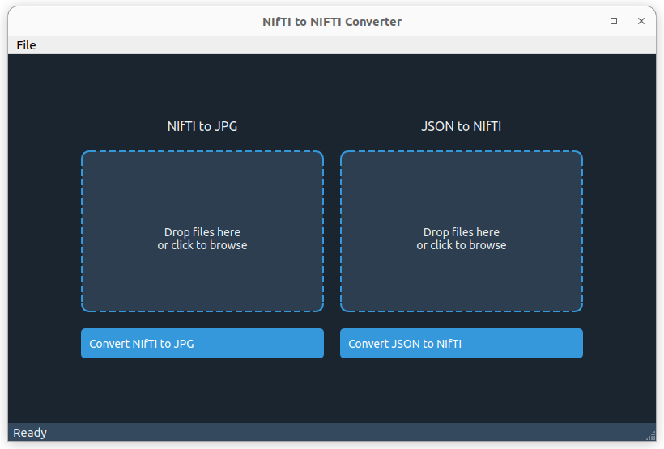

# NIFTI-JSON-Converter

A simple Python GUI application to import `.nii.gz` medical images and convert them into JPG format, as well as import mask annotations in JSON format and convert them into `.nii.gz`.

## Features

- Import `.nii.gz` medical images and convert them to JPG
- Import mask annotations in JSON format and convert them to `.nii.gz`
- User-friendly drag and drop interface

## Requirements

- Python 3.x
- nibabel
- skimage
- PyQt5

You can install the required libraries using pip:

```bash
pip install nibabel scikit-image PyQt5
```

## Usage

To start the application, simply run:

```bash

python GUI.py
```

## Interface Overview



The interface is divided into two main areas:

    Left Area: Drag and drop or select the .nii.gz file containing your images here.
    Right Area: Drag and drop or select the folder containing JSON annotations files here.

## Purpose

This tool was developed to complement the usage of a labeling tool available [here](https://github.com/yatengLG/ISAT_with_segment_anything), called ISAT_with_segment_anything. This labeling tool - based on SAM and SAM-Med2D - lacked the ability to import .nii.gz files and export annotations into .nii.gz files, so this tool was created to enable the use of medical images with that labeling tool.
